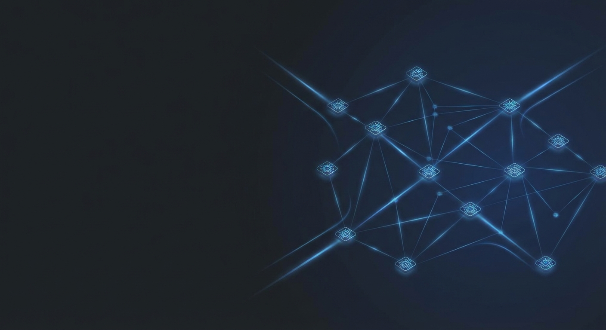
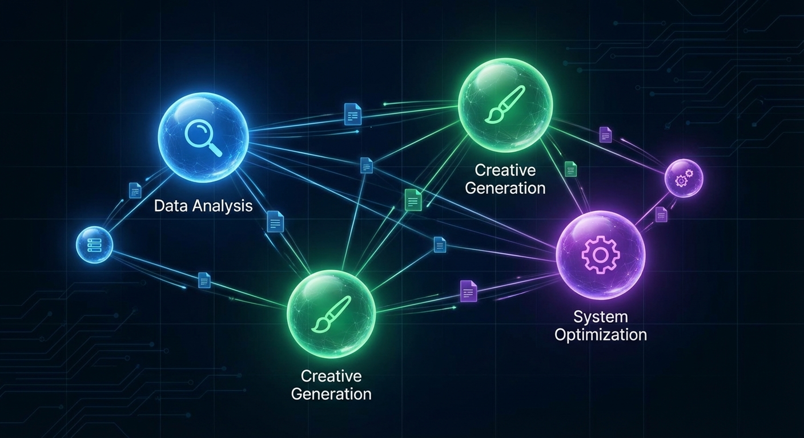

# The LinkedIn Version

> *For the quick start, see [start-here.md](start-here.md).*



---

I wasn't going to post this.

But then I realized — if this helps even one person rethink how they work with AI, it's worth sharing.

So here goes.

---

A year ago, I was using Claude Code the way most people do.

Copy. Paste. Hope for the best. Iterate.

I was spending more time correcting AI output than doing the actual work.

Sound familiar?

Then something shifted.

I stopped treating AI like a search bar.

And started treating it like a team.

That one decision changed how I build software, moderate communities, write content, and manage research — permanently.

---

**Here's what I mean.**

When you ask a generalist to do a specialist's job, you get generic results. That's not an AI problem. That's an architecture problem.

So I built a system where every task gets routed to a specialist.

You say "debug this Go test" — a Go engineer loads a debugging methodology with gated phases.

You say "write a blog post about observability" — a content pipeline launches parallel research agents, then generates with voice validation.

You say "review this PR" — five reviewers run simultaneously, each focused on a different dimension. Security. Performance. Business logic. Naming consistency. Dead code.

The router handles the dispatch. You describe the work. That's it.



---

Here are 7 things I learned building this:

🧠 **Routing is everything.** A single `/do` command classifies intent and picks the right specialist. No prompt engineering required.

🚀 **Agents need methodology, not just knowledge.** Every agent pairs with a skill — TDD, systematic debugging, code review pipelines. Knowledge without process produces inconsistent results.

🔥 **Review at scale needs parallel execution.** Five specialist reviewers running simultaneously catches things one generalist never would.

💡 **Self-improvement is the real advantage.** The system captures learnings from every session and graduates them into permanent agent instructions. Every review finding becomes a structural improvement.

🎯 **Hooks are underrated.** Lifecycle automation — firing at session start, after errors, before context compression — handles the repetitive work without manual intervention.

⚡ **This isn't just for code.** Research pipelines. Content creation with voice matching. Community moderation. Data analysis. The agent-skill-hook pattern works for any structured workflow.

🏗️ **Compounding beats prompting.** Every session makes the next one better. That's not a feature. That's the architecture.

---

I need to be transparent about something.

This took a year of daily iteration.

Not a weekend project. Not a hackathon demo. A year of using it on real work, finding the gaps, filling them, and watching the system improve itself.

The result:

- Domain specialists for Go, Python, TypeScript, Kubernetes, databases, and more
- Workflow skills for everything from TDD to article writing to Reddit moderation
- A learning database that tracks patterns and graduates them into agent behavior
- Parallel review pipelines that catch issues before they reach production
- Content pipelines that handle research, drafting, and voice validation end to end

Was it worth it?

I type `/do` and the right specialist shows up. I don't prompt anymore. I delegate.

---

Here's the thing most people miss about AI tooling.

The gap between AI-assisted and AI-native isn't about the model.

It's about the scaffolding around it.

Agents that know your domain. Skills that enforce methodology. Hooks that automate the repetitive parts. A learning system that turns every session into improvement.

Your `.claude/` directory might be the most underutilized part of your development workflow. This toolkit fills it with a team.

---

The repo is open source. MIT licensed. Three commands to install:

```
git clone https://github.com/notque/claude-code-toolkit.git
cd claude-code-toolkit
./install.sh
```

It works with any project, any language, any workflow.

If this resonated:

⭐ Star the repo — it helps others find it

🔀 Fork it and build your own agents

💬 I'm always happy to discuss how agentic workflows change the way teams operate


---

You don't need a better model.

You need a better system.

Agree? 👇

---

*#AI #ClaudeCode #AgenticAI #OpenSource #DevTools #BuildInPublic #LLMOps #AIEngineering*
